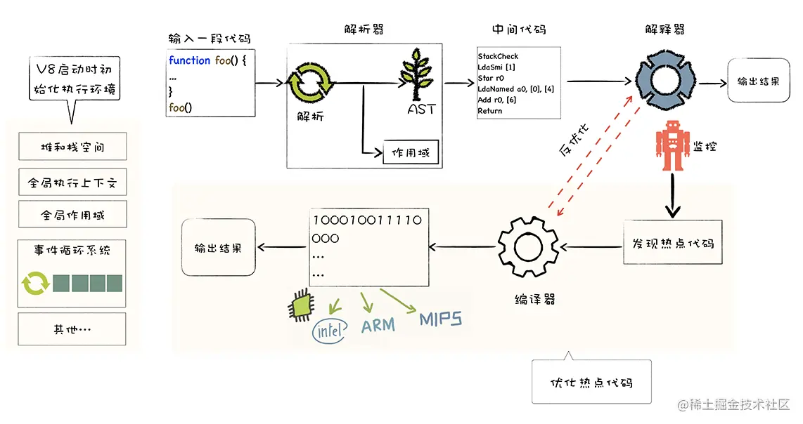

# V8执行JS的过程
JS虚拟机就是模拟计算机的编译执行流程。比较流行的虚拟机有苹果公司Safari的JSCore虚拟机，Firefox的TraceMonkey虚拟机，Chrome的V8虚拟机。

V8率先引入JIT，使用编译执行和混合执行两种手段，引入惰性编译，内联缓存，隐藏类等机制，提升js执行速度。参考下面V8执行JS的流程图。

- V8启动JS之前，需要准备执行JS需要的基础环境。这些基础环境包括“堆空间”“栈空间”“全局执行上下文”“全局作用域”“消息循环系统”“内置函数”等。
- V8接收到JS源代码后，结构化JS字符串，生成AST；同时生成相关的作用域。
- V8基于AST和作用域，生成可执行的字节码。解释器可以直接执行字节码，或者通过编译器将其编译为二进制的机器代码再执行。
- 解释器执行字节码过程中，如果发现代码被重复执行，监控机器人会把这段代码标记为热点代码。热点代码会丢给优化编译器编译成二进制代码，然后优化。下次再执行时就执行这段优化后的二进制代码。
- 如果JS对象发生变更，优化后的二进制代码变为无效代码，编译器执行反优化，下次执行就回退到解释器解释执行。

#### V8执行js的主要流程如下：

- 初始化基础环境
- 解析源码生成ast和作用域
- 依据ast和作用域生成字节码
- 解释器解释执行字节码
- 监听热点代码
- 编译器优化热点代码为二进制的机器码
- 反优化二进制机器代码