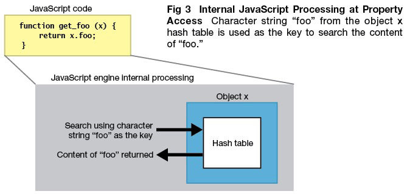

# JS语言设计

## 数据表示
JavaScript是一种动态类型语言，在编译时并不能准确知道变量的类型，只可以在运行时确定，这就不像c++或者java等静态类型语言，在编译时候就可以确切知道变量的类型。然而，在运行时计算和决定类型，会严重影响语言性能，这也就是JavaScript运行效率比C++或者JAVA低很多的原因之一。

在C++中，源代码需要经过编译才能执行，在生成本地代码的过程中，变量的地址和类型已经确定，运行本地代码时利用数组和位移就可以存取变量和方法的地址，不需要再进行额外的查找，几个机器指令即可完成，节省了确定类型和地址的时间。由于JavaScript是无类型语言，那就不能像c++那样在执行时已经知道变量的类型和地址，需要临时确定。JavaScript 和C++有以下几个区别：

编译确定位置，C++编译阶段确定位置偏移信息，在执行时直接存取，JavaScript在执行阶段确定，而且执行期间可以修改对象属性；
偏移信息共享，C++有类型定义，执行时不能动态改变，可共享偏移信息，JavaScript每个对象都是自描述，属性和位置偏移信息都包含在自身的结构中；
偏移信息查找，C++查找偏移地址很简单，在编译代码阶段，对使用的某类型成员变量直接设置偏移位置，JavaScript中使用一个对象，需要通过属性名匹配才能找到相应的值，需要更多的操作。
在代码执行过程中，变量的存取是非常普遍和频繁的，通过偏移量来存取，使用少数两个汇编指令就能完成，如果通过属性名匹配则需要更多的汇编指令，也需要更多的内存空间。示例如下：

在JavaScript中，除boolean，number，string，null，undefined这个五个简单变量外，其他的数据都是对象，V8使用一种特殊的方式来表示它们，进而优化JavaScript的内部表示问题。

在V8中，数据的内部表示由数据的实际内容和数据的句柄构成。数据的实际内容是变长的，类型也是不同的；句柄固定大小，包含指向数据的指针。这种设计可以方便V8进行垃圾回收和移动数据内容，如果直接使用指针的话就会出问题或者需要更大的开销，使用句柄的话，只需修改句柄中的指针即可，使用者使用的还是句柄，指针改动是对使用者透明的。

除少数数据(如整型数据)由handle本身存储外，其他内容限于句柄大小和变长等原因，都存储在堆中。整数直接从value中取值，然后使用一个指针指向它，可以减少内存的占用并提高访问速度。一个句柄对象的大小是4字节(32位设备)或者8字节(64位设备)，而在JavaScriptCore中，使用的8个字节表示句柄。在堆中存放的对象都是4字节对齐的，所以它们指针的后两位是不需要的，V8用这两位表示数据的类型，00为整数，01为其他。

JavaScript对象在V8中的实现包含三个部分：隐藏类指针，这是v8为JavaScript对象创建的隐藏类；属性值表指针，指向该对象包含的属性值；元素表指针，指向该对象包含的属性。