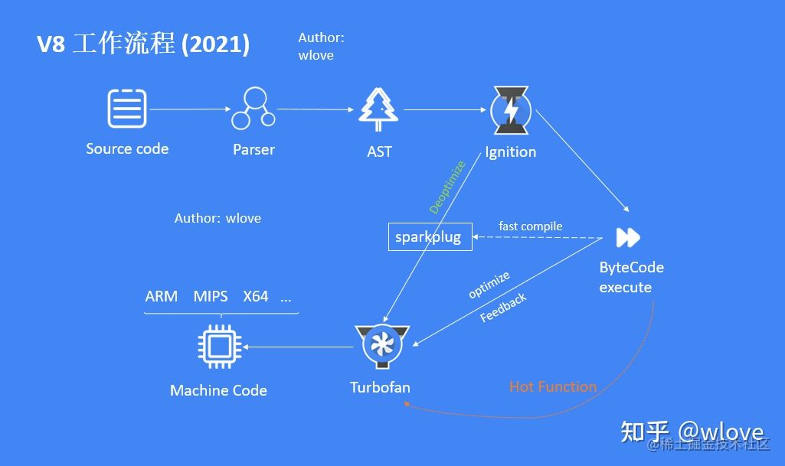
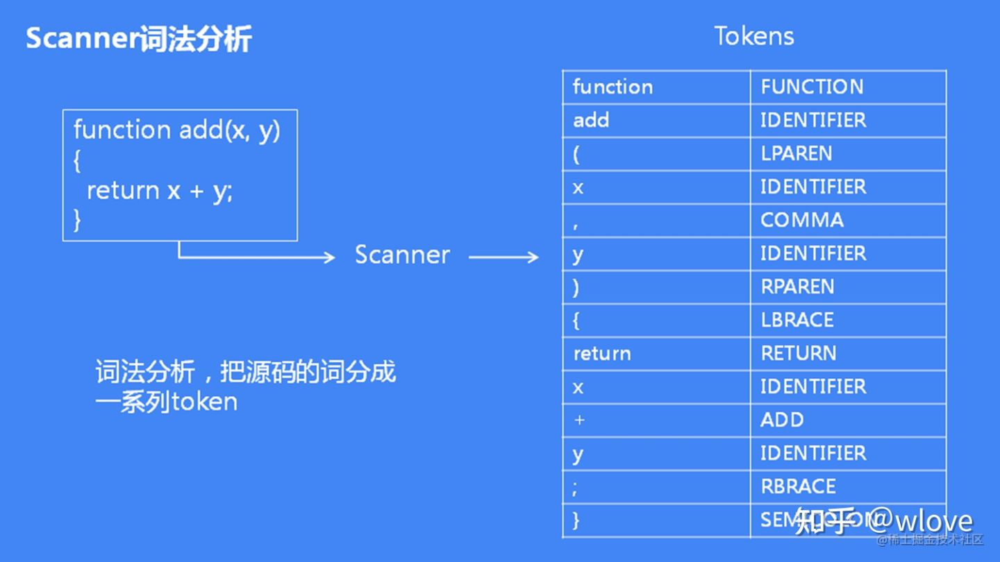
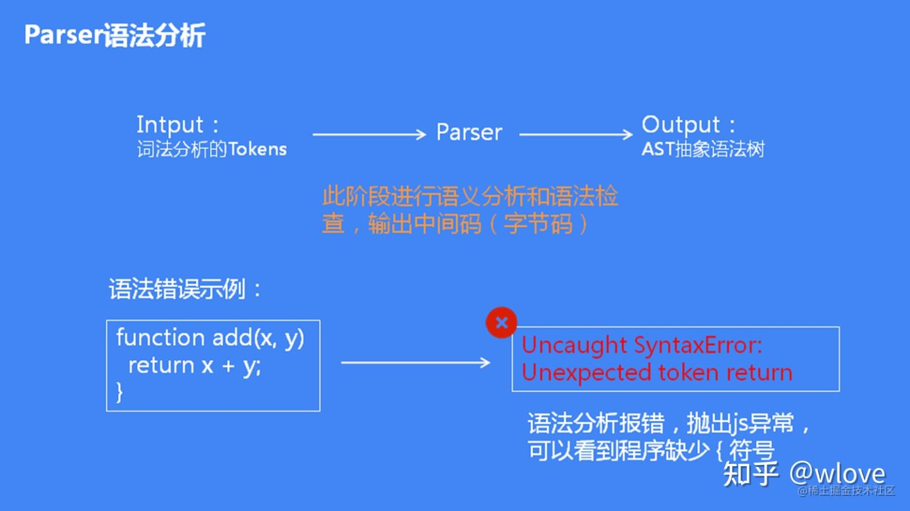
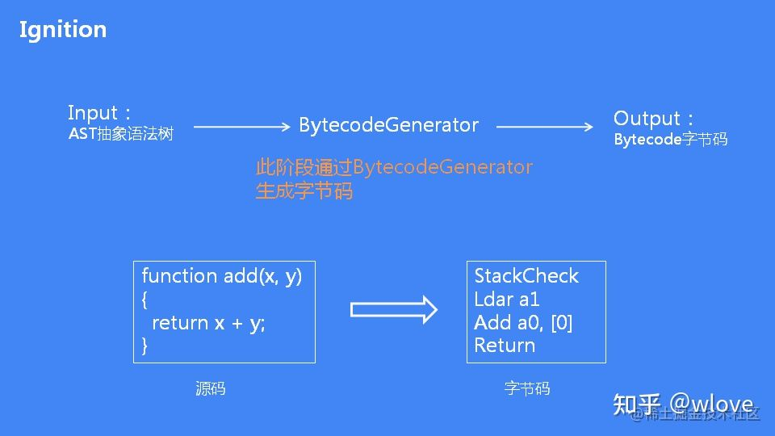
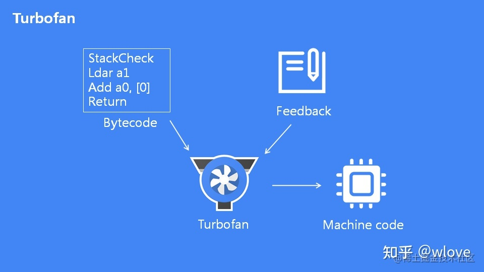
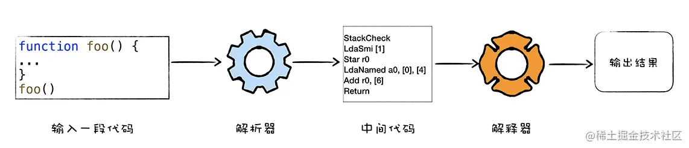
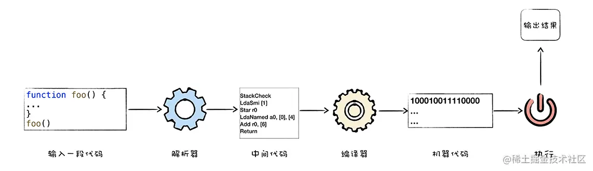

# js引擎

## 基本结构

1. 解析器 Parser
2. 解释器 Ignition
3. 优化编译器 TurboFan

A. Parser 解析器 会把源码解析为抽象语法树AST。
  它的解析过程是：根据语法规则将tokens组成一个有嵌套层级的抽象语法树AST，在分析过程中 如果源码不符合规范，解析过程就会终止并抛出语法错误 解析过程分为2步：
  1. 词法分析Scanner, 将字符流(一行行代码)转化为tokens(语法上不能再分割的最小单位，单个字符或字符串)
  2. 语法分析Pre-Parser, Parser, 在解析过程中实现了延迟解析，它的思想是：对于不是立即执行函数，只进行预解析(语法有效、检查函数申明、确定函数作用域)，只有当函数调用时才对函数进行全量解析。如果，所有源码执行前 都需要完全解析再执行，那么它的问题：代码执行时间变长，而且解析AST和编译字节码 会消耗更多内存，编译后的代码会缓存在磁盘 占用磁盘空间，因此v8采用了延迟解析。

B. Ignition 解释器将AST转为字节码的过程，使用边解释边执行的方法来优化执行的速度，它会检查代码片段的运行次数，如果，代码超过执行阈值，那么它就会被标记为热代码HotCode，最后把热代码反馈给优化编译器TurboFan 它把变量放在通用寄存器中，运算放在累加寄存器中。

C. TurboFan 优化编译器 TurboFan会优化字节码，最后把优化后的字节码转化为机器码。编译后的字节码更容易优化。 TurboFan的优化方式：
  1. 内联：是把两个函数进行内联，它降低函数复杂度、消除冗余代码、把常量合并，它也是逃逸分析的基础
  2. 逃逸分析：  逃逸是指 函数内创建的对象 除了在函数内被引用外 还在函数外被其它变量引用，在方法执行完毕之后 因为方法中的对象被其它变量引用 而将无法被GC回收。  未逃逸是指 对象的生命周期局限在当前函数函数中，那么该对象将在执行完毕之后被回收。  TurboFan 用函数参数替换函数中的对象，这样函数中就不会有对象定义，对象直接来源于参数，它的好处：变量加载到寄存器后 不再需要从内存中读取，提升执行效率还减少了内存使用。当下次js代码再次执行时，解释器就直接使用该机器码 ，避免了多次解释，这样就极大的提高执行性能。




名词解释:
1. source code: Javascript
2. Parser  处理为AST的Parser(解析器)
3. AST 抽象语法树Ignition
4. 解释器 将AST转换为byteCode
5. Sparkplug 无优化编译器 可以理解为将byteCode预编译(非常的快速)
6. byteCode execute 字节码 可以理解为跨平台的一种编码(非平台机器码)
7. Turbofan   优化编译器 对于byteCode进行编译并对于代码进行优化
8. Machine Code  机器码 各平台执行的代码

### Source Code

就是指Javascript源代码 至于你开发中使用的是TypeScript,在进入浏览器之前也是需要编译成Js的 可以理解为V8只识别JS。 下边拿一个函数进行分析:
``` javascript
function add(x,y){   // <- top level code  解析环节。
    return x + y;    // <- non top level
}
```

### parser
1. 词法分析

2. 语法分析


### AST

AST是指源代码的抽象语法结构的树状表现形式.

### Ignition ==> byteCode
Parser过后就是生成字节码 这个是V8内部的类BytecodeGenerator进行生成的。


### Turbofan
Turbofan是根据字节码和热点函数反馈类型生成优化后的机器码，Turbofan很多优化过程，基本和编译原理的后端优化差不多，采用的sea-of-node。


### Sparkplug
Sparkplug 旨在快速编译。 非常快。 速度如此之快，几乎可以随时编译，所以能够比 TurboFan 代码更积极地对 Sparkplug 代码进行分层。


1. Sparkplug所编译的是byteCode
2. Sparkplug编译不做优化
3. Sparkplug只需要与解析器Ignition行为镜像 不需要某种状态的映射


### 解释执行/编译执行
由于计算机处理器不能直接识别由高级语言所编写的代码，所以需要将这些高级语言编译成机器可执行的代码。


#### 解释执行
解释执行就是将输入的源代码通过解析器编译成中间代码，再使用解释器解释执行中间代码，然后输出结果。流程图如下：


优点是启动速度快，执行速度慢。

#### 编译执行
编译执行就是将输入的源代码通过解析器转换成中间代码，再通过编译器将中间代码编译成机器代码。

可以直接执行编译后的二进制机器代码文件；也可以通过虚拟机将机器代码保存到内存中，再执行内存中的二进制代码。流程图如下：


优点是启动速度慢，执行速度快。缺点是可移植性差。

### V8执行JS的过程
JS虚拟机就是模拟计算机的编译执行流程。比较流行的虚拟机有苹果公司Safari的JSCore虚拟机，Firefox的TraceMonkey虚拟机，Chrome的V8虚拟机。

V8率先引入JIT，使用编译执行和混合执行两种手段，引入惰性编译，内联缓存，隐藏类等机制，提升js执行速度。参考下面V8执行JS的流程图。


- V8启动JS之前，需要准备执行JS需要的基础环境。这些基础环境包括“堆空间”“栈空间”“全局执行上下文”“全局作用域”“消息循环系统”“内置函数”等。
- V8接收到JS源代码后，结构化JS字符串，生成AST；同时生成相关的作用域。
- V8基于AST和作用域，生成可执行的字节码。解释器可以直接执行字节码，或者通过编译器将其编译为二进制的机器代码再执行。
- 解释器执行字节码过程中，如果发现代码被重复执行，监控机器人会把这段代码标记为热点代码。热点代码会丢给优化编译器编译成二进制代码，然后优化。下次再执行时就执行这段优化后的二进制代码。
- 如果JS对象发生变更，优化后的二进制代码变为无效代码，编译器执行反优化，下次执行就回退到解释器解释执行。


#### V8执行js的主要流程如下：

- 初始化基础环境
- 解析源码生成ast和作用域
- 依据ast和作用域生成字节码
- 解释器解释执行字节码
- 监听热点代码
- 编译器优化热点代码为二进制的机器码
- 反优化二进制机器代码

##
- JIT
- 惰性编译
- 内联缓存
- 隐藏类
- 预解析Lazy Parsing（延迟解析）

javascript 会被解析两次，第一次用于 Full-Codegen 生成机器码，而第二次用于 Crankshaft 进行优化
Full-Codegen 生成机器码会占用大量内存，一个 1M 左右 的 js 源码的文件，编译生成的二进制代码可能就是十几 M，而早期手机的内存普遍不高，过度占用会导致性能大大降低
而且为了兼容不同架构 CPU Full-Codegen引擎以及优化编译的Crankshaft引擎要针对不同的CPU架构编写代码

TurboFan 图生成器可以直接利用生成好的字节码，然后在 TurboFan 里面优化函数，这样就避免了重新解析 JavaScript 源代码
字节码引入降低 CPU Full-Codegen引擎以及优化编译的Crankshaft引擎要针对不同的CPU架构编写代码繁重的工作
字节码体积相对于机器码要小得多

有了字节码我们在这个层面进行优化和兼容不同架构 cpu 的工作